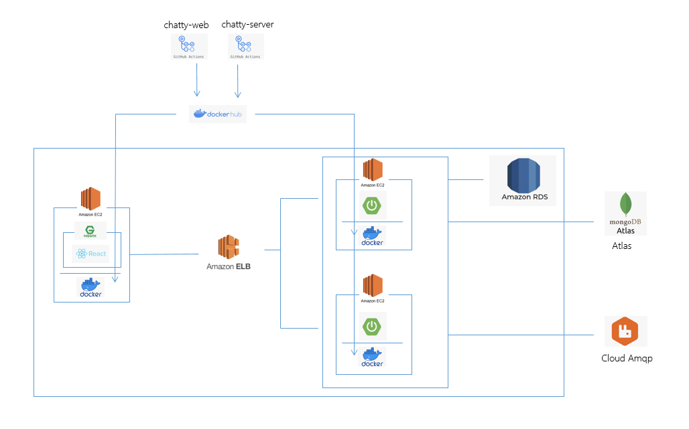

# 1. Outline
Our service `'Chatty'` is a lightweight and simplified web messenger chat service. It mimics the overall functionality of Slack and Discord.

# 2. Technology stack
- springboot 
- rabbitMQ (message broker)
- mysql (main db)
- mongodb (for storing chatting message)

# 3. run locally
### 1. installation
1-1. basically, please set up the Java environment to run a Spring Boot project.

1-2. install RabbitMQ, MongoDB, and MySQL locally.

1-3. Create a `.env` file in the root directory to define the required variables for connecting with the application. Refer to `src/main/java/resources/application-local.yml` to check what you have to define in `.env`.
### 2. run
execute the main method in `src\main\java\com\messenger\chatty\ChattyApplication.java`

# 4. deploy
This project is not intended for actual service operation, but assumes a service environment and has configured a deployment infrastructure. We also automated CI/CD using GitHub workflows.

- `Docker-based` automation.
- `ELB` for load balancing.
- Application server deployed on EC2.
- MySQL DB deployed on `RDS`.
- RabbitMQ and MongoDB deployed on `CloudAMQP` and `MongoDB` Atlas Cloud, respectively (not using AWS services due to server cost issues).
- All the infrastructure setup for the 'Chatty' project can be seen in the image below.

